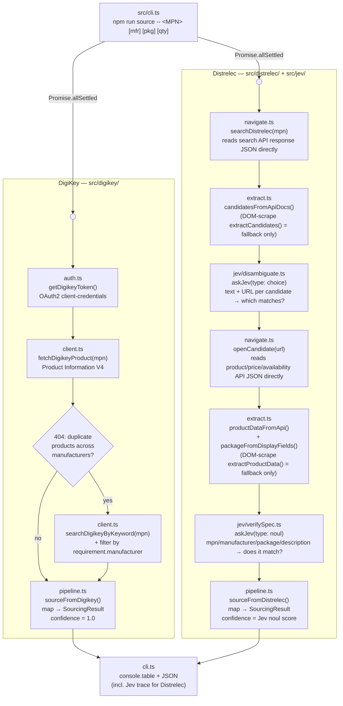

# JevBrowserAutomation-poc

Proof-of-concept: given a component part number, source it from two real suppliers at once — **DigiKey** (has a public API) and **Distrelec** (doesn't — a real browser searches their live site, and **Jev**, an AI judgment model, decides which result is actually correct and whether it really matches what was asked for).

## Quick Start

```bash
git clone <this-repo-url>
cd JevBrowserAutomation-poc
npm install
npx playwright install chromium   # downloads the browser binary, ~350MB, do this ahead of time
```

Then place a `.env` file in the project root (provided separately — not part of the repo) containing:
```
OPENROUTER_JEV_API=...
DIGIKEY_CLIENT_ID=...
DIGIKEY_CLIENT_SECRET=...
DIGIKEY_USE_SANDBOX=false
```

Run it — arguments are part number, manufacturer, package, quantity (manufacturer/package/quantity are optional but improve match accuracy):
```bash
npm run source -- STM32F407VGT6 STMicroelectronics LQFP-100 100
```

**What to expect:** takes roughly 30–60 seconds. A real Chrome window will briefly pop up on screen partway through — that's expected, it's Distrelec's side actually searching their live site, not an error. Output is a side-by-side results table (DigiKey vs. Distrelec: manufacturer, price, stock, a confidence score) followed by the full JSON, including Jev's reasoning trace for the Distrelec result.

### Demo-ready commands (confirmed matches on both DigiKey and Distrelec)

Copy-paste any of these to get a full result from both suppliers, not a "not found" on one side:

```bash
npm run source -- STM32F407VGT6 STMicroelectronics LQFP-100 100
```
```bash
npm run source -- RC0805FR-071KL Yageo 0805 500
```
```bash
npm run source -- ATMEGA328P-PU Microchip DIP-28 50
```

Run all three back to back in one line:
```bash
npm run source -- STM32F407VGT6 STMicroelectronics LQFP-100 100 && npm run source -- RC0805FR-071KL Yageo 0805 500 && npm run source -- ATMEGA328P-PU Microchip DIP-28 50
```

Note: not every part number Distrelec is asked about will return a match — that's expected and correct (they stock a different catalog than DigiKey; see Status below), not a bug. The three above are confirmed working on both suppliers specifically so a live demo shows the full comparison rather than a "not found" row.

## Contents

- [`how-to-use-jev.md`](./how-to-use-jev.md) — reference guide covering auth, the decisions endpoint, model IDs, request/response shapes, question types, and rate/credit limits.
- [`src/`](./src) — the POC: BOM-style component sourcing from **Distrelec** (no public API — Playwright browser automation, with Jev used to disambiguate search results and verify the chosen product actually matches spec) and **DigiKey** (public Product Information V4 API — no Jev needed, the data is already structured and trusted).

## Why two suppliers, two approaches

DigiKey exposes a clean developer API, so sourcing from it is a direct API call — no judgment involved. Distrelec doesn't expose a public API, so a search results page has to be navigated and read the way a human would; Jev stands in for the human judgment call of "which result is actually correct" and "does this data really match what was asked for." The POC proves the harder path (Distrelec + Jev) works and stays resilient to page changes, and pairs it with the trivial path (DigiKey) to produce a real side-by-side comparison.

## Architecture

Full target architecture (including production-only refinements not built in this POC — a vision-based navigation fallback, a per-supplier circuit breaker, and confidence-threshold calibration) is documented separately. This POC implements the core loop: `navigate → extract → Jev disambiguate → navigate → extract → Jev verify → result` for Distrelec, plus DigiKey's API path — no job queue, database, cache, or ranking engine.

**Key architectural finding: don't scrape the DOM if you don't have to.** Distrelec's storefront is an Angular SPA — the rendered page lags behind the data that's actually available, by an inconsistent amount (sometimes near-instant, sometimes 15+ seconds), which made DOM-text scraping fundamentally unreliable no matter how the wait was tuned (fixed delays, content-appearance waits, retries — all tried, all still occasionally lost the race). The fix wasn't a better wait — it was **reading the same backend JSON APIs the page itself calls**, directly, instead of waiting for Angular to paint them into the DOM:
- Search results: `search.distrelec.com/api/apps/webshop/query/search?q=...` — full structured doc list (title, URL, manufacturer, price, stock status) in one deterministic response.
- Product detail: `api.distrelec.com/.../products/{id}` — manufacturer, description, and (via `displayFields`) labeled spec attributes like package type.
- Price: `api.distrelec.com/.../products/{id}/prices`.
- Availability: `api.distrelec.com/.../products/availability`.

DOM scraping (`extractCandidates`'s fallback path, `parseProductFields`'s regex parsing) is kept as a fallback for if Distrelec ever changes these endpoints — but it is not the primary path anymore, and confidence/reliability differs sharply between the two: the API path is deterministic and fast; the DOM path is what caused most of the flakiness during development.



`SourcingResult` (`src/types.ts`) is the shared shape both pipelines return, so the CLI can print them side by side regardless of which path produced them.

### DigiKey isn't always a single deterministic call either

`productdetails` (an exact-MPN lookup) 404s with *"Duplicate Products found... provide manufacturerId"* when multiple manufacturers happen to share an MPN (e.g. `ATMEGA328P-PU`). There's no direct MPN→manufacturerId lookup endpoint (`/products/v4/manufacturers` 404s), so this is resolved by calling DigiKey's `KeywordSearch` endpoint for a real candidate list and filtering it by `requirement.manufacturer` — the same kind of disambiguation Jev does for Distrelec, just done with a plain filter instead of a model call, since DigiKey's candidates already come back as clean structured data with no page to misread.

## Status

Tested against ~15 real, distinct part numbers across categories (microcontrollers, transistors, resistors, capacitors, connectors, an FPGA) — correct matches at 0.9+ confidence, correct rejections of non-matches, and correct "not found" for parts a supplier genuinely doesn't stock. No known crashes in either supplier's path.

**Known, understood, intentional limitations (not bugs):**
- **Distrelec runs in headed (visible) browser mode, not headless.** Distrelec runs Radware Bot Manager; a default headless launch gets challenged/blocked immediately (keyed off the `HeadlessChrome` UA string), and a spoofed-UA headless attempt worked once but was inconsistently blocked on repeat requests. Headed mode got through reliably in all testing. This is **not production-viable as-is** — a real deployment can't pop open a visible browser on a server — and needs either proper anti-detection infrastructure or a direct conversation with Distrelec about legitimate automated access, which is exactly the scenario the target architecture's Circuit Breaker and compliance-gate components exist for.
- **Distrelec's catalog genuinely differs from DigiKey's.** Several real, common parts (`LM358P`, `NE555P`, a specific TE Connectivity connector) returned zero results directly from Distrelec's own search backend — confirmed by testing broader search terms (e.g. `LM358` without the exact suffix returns real results under different package variants). Different distributors stock different exact SKUs of the same base part; this is real inventory data, not a defect.
- **DOM-scraping fallback paths are lightly tested.** Since the API-first approach became the primary path, the DOM-scrape fallback (`extractCandidates`, `parseProductFields`) rarely executes anymore. It's still there for resilience if Distrelec changes their API, but hasn't been exercised as thoroughly as the primary path.

**Fixed during testing, worth knowing about if touching this code:**
- `choice`-type Jev questions require `criteria` as a record (`{key: description}`), not an array, despite `how-to-use-jev.md`'s original example — the live API rejects an array with a 400.
- A JavaScript gotcha: `parseInt(x) || null` silently turns a genuine `0` result into `null` (0 is falsy) — check for `NaN` explicitly instead. This hid a real "0 in stock" result as an apparent capture failure.
- Named local functions inside `page.evaluate()` throw `ReferenceError: __name is not defined` under tsx/esbuild — inline the logic instead of assigning it to a named const.

## License

Licensed under the [Apache License 2.0](./LICENSE).
