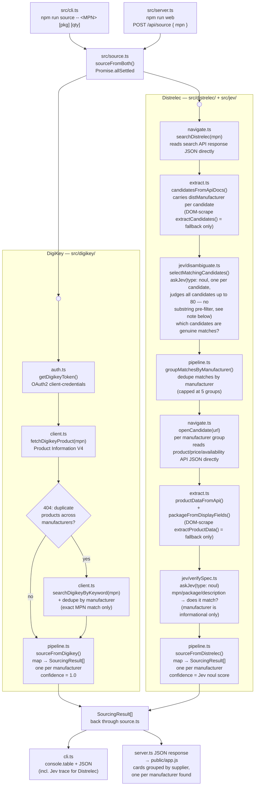

# JevBrowserAutomation-poc

Proof-of-concept: given only a component part number — **no manufacturer supplied** — source it from two real suppliers at once — **DigiKey** (has a public API) and **Distrelec** (doesn't — a real browser searches their live site, and **Jev**, an AI judgment model, decides which results are actually correct and whether they really match what was asked for). Manufacturer isn't an input here — it's discovered: if a part name genuinely matches more than one manufacturer's product, every one of them comes back as its own result rather than the tool silently guessing one.

## Quick Start

```bash
git clone <this-repo-url>
cd JevBrowserAutomation-poc
npm install
npx playwright install chromium   # downloads the browser binary, ~350MB, do this ahead of time
```

Then place a `.env` file in the project root (provided separately — not part of the repo) containing:

```
OPENROUTER_JEV_API=...
DIGIKEY_CLIENT_ID=...
DIGIKEY_CLIENT_SECRET=...
DIGIKEY_USE_SANDBOX=false
```

Run it — arguments are part number, package, quantity (package/quantity are optional):

```bash
npm run source -- STM32F407VGT6
```

**What to expect:** takes roughly 30–90 seconds (longer than a single-manufacturer lookup when a part name resolves to several real manufacturers — each one gets its own product-page open + verify round trip). A real (but off-screen positioned) Chrome window briefly runs in the background partway through — that's Distrelec's side actually searching their live site, not an error; it's kept out of the way rather than popping up on screen. Output is a results table — one row per (supplier, manufacturer) pair, since a bare part name can legitimately match more than one manufacturer — followed by the full JSON, including Jev's reasoning trace for the Distrelec result(s).

### Demo-ready commands (confirmed matches on both DigiKey and Distrelec)

Copy-paste any of these to get a full result from both suppliers, not a "not found" on one side:

```bash
npm run source -- STM32F407VGT6
```

```bash
npm run source -- RC0805FR-071KL
```

```bash
npm run source -- ATMEGA328P-PU
```

`ATMEGA328P-PU` is also a good demo of the multi-manufacturer path specifically — DigiKey's own data has more than one manufacturer listed under that exact MPN.

Run all three back to back in one line:

```bash
npm run source -- STM32F407VGT6 && npm run source -- RC0805FR-071KL && npm run source -- ATMEGA328P-PU
```

Note: not every part number Distrelec is asked about will return a match — that's expected and correct (they stock a different catalog than DigiKey; see Status below), not a bug. The three above are confirmed working on both suppliers specifically so a live demo shows the full comparison rather than a "not found" row.

### Web UI (for a client-facing demo)

A simple browser-based version of the same thing — type a part number, get results, no terminal needed:

```bash
npm run web
```

Then open **http://localhost:3000** in a browser. Enter a part number, click Search. Results are grouped into a section per supplier; each section holds one card per manufacturer match found (labeled "Manufacturer" above the name, with price, stock, and a confidence badge — Confirmed match / Needs review / Weak match, using the same 0.85 / 0.40 thresholds as the target architecture's Confidence Gate), with a link through to the actual product page. A supplier section shows a "N manufacturers found" note when more than one manufacturer matched (confirmed working live: `ATMEGA328P-PU` correctly shows "2 manufacturers found" under DigiKey).

Same underlying pipeline as the CLI (`src/source.ts` is shared by both) — no separate logic to keep in sync. The Distrelec browser session still runs the same way (headed, positioned off-screen) as described above.

## Contents

- [`how-to-use-jev.md`](./how-to-use-jev.md) — reference guide covering auth, the decisions endpoint, model IDs, request/response shapes, question types, and rate/credit limits.
- [`src/`](./src) — the POC: BOM-style component sourcing from **Distrelec** (no public API — Playwright browser automation, with Jev used to disambiguate search results and verify the chosen product actually matches spec) and **DigiKey** (public Product Information V4 API — no Jev needed, the data is already structured and trusted).

## Tech stack

- **TypeScript** (`tsx` for running `.ts` directly in dev, `tsc` for the `build` script) — everything under `src/` and `public/app.js` (plain JS, browser-side, no bundler).
- **Node.js**, ESM (`"type": "module"` in `package.json`).
- **Express** — `src/server.ts`, the web UI's server (`/api/source` endpoint + serving `public/`).
- **Playwright** (`chromium`) — drives the real, headed browser session against Distrelec (`src/distrelec/navigate.ts`).
- **Jev** (via OpenRouter's decisions API, `~typesafe/jev-latest`) — the AI judgment model used only on the Distrelec side, for candidate disambiguation and spec verification (`src/jev/`).
- **DigiKey Product Information V4 API** — OAuth2 client-credentials, direct REST calls, no SDK (`src/digikey/`).
- **dotenv** — loads `.env` (API keys) in both the CLI and the web server.
- Plain HTML/CSS/JS for the web UI (`public/`) — no frontend framework.

## Why two suppliers, two approaches

DigiKey exposes a clean developer API, so sourcing from it is a direct API call — no judgment involved. Distrelec doesn't expose a public API, so a search results page has to be navigated and read the way a human would; Jev stands in for the human judgment call of "which result is actually correct" and "does this data really match what was asked for." The POC proves the harder path (Distrelec + Jev) works and stays resilient to page changes, and pairs it with the trivial path (DigiKey) to produce a real side-by-side comparison.

## Architecture

Full target architecture (including production-only refinements not built in this POC — a vision-based navigation fallback, a per-supplier circuit breaker, and confidence-threshold calibration) is documented separately. This POC implements the core loop: `navigate → extract → Jev finds every plausible match → group by manufacturer → (navigate → extract → Jev verify) per manufacturer → results` for Distrelec, plus DigiKey's API path — no job queue, database, cache, or ranking engine.

**No manufacturer input, so ambiguity fans out instead of collapsing.** Earlier versions of this POC took an optional `manufacturer` argument and used it to filter down to one result when a part name matched more than one manufacturer. That input is gone — a bare part name is genuinely ambiguous across manufacturers sometimes (e.g. `ATMEGA328P-PU`), and there's no honest way to pick "the" manufacturer without being told which one is wanted. So instead: DigiKey's ambiguity-resolution path now returns every distinct manufacturer with an exact MPN match, and Distrelec's Jev disambiguation step changed from "pick the single best candidate" (a `choice` question) to "which of these candidates are genuinely real matches" (one `noul` question per candidate, judging every extracted candidate rather than a pre-filtered subset — see the cap note just below) — the surviving matches are grouped by manufacturer (from the search API's own `distManufacturer` field) and each distinct manufacturer gets its own product-page open + verify pass. `SourcingResult` is no longer one-per-supplier; it's one per `(supplier, manufacturer)` pair.

**Judge every candidate, don't pre-filter by a substring heuristic.** The first version of the per-candidate `noul` batch capped itself at the 15 candidates whose text/URL most looked like they contained the literal MPN, to bound request size. That broke real cases: Distrelec's product URLs are description slugs, not part numbers (e.g. `.../smd-resistor-125mw-1kohm-0805-yageo-rc0805fr-071kl/p/...`), so on a noisy DOM-scrape-fallback candidate list, no candidate matched the substring heuristic, the sort was a no-op, and the real product could land outside the top 15 and never get judged at all — confirmed on `RC0805FR-071KL`, which regressed to a false "not found" on Distrelec. Fixed by judging every candidate up to the same 80-candidate cap `extractCandidates` already applies (matching what the old single `choice` call effectively saw), and shortening each question's `instructions` to reference `state.candidates[index]` instead of repeating the candidate's text/link inline, so judging more candidates doesn't blow up request size.

**Key architectural finding: don't scrape the DOM if you don't have to.** Distrelec's storefront is an Angular SPA — the rendered page lags behind the data that's actually available, by an inconsistent amount (sometimes near-instant, sometimes 15+ seconds), which made DOM-text scraping fundamentally unreliable no matter how the wait was tuned (fixed delays, content-appearance waits, retries — all tried, all still occasionally lost the race). The fix wasn't a better wait — it was **reading the same backend JSON APIs the page itself calls**, directly, instead of waiting for Angular to paint them into the DOM:

- Search results: `search.distrelec.com/api/apps/webshop/query/search?q=...` — full structured doc list (title, URL, manufacturer, price, stock status) in one deterministic response.
- Product detail: `api.distrelec.com/.../products/{id}` — manufacturer, description, and (via `displayFields`) labeled spec attributes like package type.
- Price: `api.distrelec.com/.../products/{id}/prices`.
- Availability: `api.distrelec.com/.../products/availability`.

DOM scraping (`extractCandidates`'s fallback path, `parseProductFields`'s regex parsing) is kept as a fallback for if Distrelec ever changes these endpoints — but it is not the primary path anymore, and confidence/reliability differs sharply between the two: the API path is deterministic and fast; the DOM path is what caused most of the flakiness during development.



`SourcingResult` (`src/types.ts`) is the shared shape both pipelines return — now one per `(supplier, manufacturer)` pair rather than one per supplier — so the CLI can print them all side by side regardless of which path or how many manufacturers produced them.

### DigiKey isn't always a single deterministic call either

`productdetails` (an exact-MPN lookup) 404s with _"Duplicate Products found... provide manufacturerId"_ when multiple manufacturers happen to share an MPN (e.g. `ATMEGA328P-PU`). There's no direct MPN→manufacturerId lookup endpoint (`/products/v4/manufacturers` 404s), so this is resolved by calling DigiKey's `KeywordSearch` endpoint for a real candidate list, filtering to exact MPN matches, and deduping by manufacturer name — every distinct manufacturer found becomes its own result, since there's no `requirement.manufacturer` left to narrow it down to one.

## Status

Tested against ~15 real, distinct part numbers across categories (microcontrollers, transistors, resistors, capacitors, connectors, an FPGA) — correct matches at 0.9+ confidence, correct rejections of non-matches, and correct "not found" for parts a supplier genuinely doesn't stock. No known crashes in either supplier's path. Manufacturer-input removal and the resulting multi-manufacturer fan-out (`ATMEGA328P-PU` on both DigiKey and Distrelec), single-manufacturer cases, and both flavors of not-found (nonexistent part, real catalog gap) all check out on both the CLI and the web UI.

**Known, understood, intentional limitations (not bugs):**

- **Distrelec runs in headed (visible) browser mode, not headless.** Distrelec runs Radware Bot Manager; a default headless launch gets challenged/blocked immediately (keyed off the `HeadlessChrome` UA string), and a spoofed-UA headless attempt worked once but was inconsistently blocked on repeat requests. Headed mode got through reliably in all testing. This is **not production-viable as-is** — a real deployment can't pop open a visible browser on a server — and needs either proper anti-detection infrastructure or a direct conversation with Distrelec about legitimate automated access, which is exactly the scenario the target architecture's Circuit Breaker and compliance-gate components exist for.
- **Distrelec's catalog genuinely differs from DigiKey's.** Several real, common parts (`LM358P`, `NE555P`, a specific TE Connectivity connector) returned zero results directly from Distrelec's own search backend — confirmed by testing broader search terms (e.g. `LM358` without the exact suffix returns real results under different package variants). Different distributors stock different exact SKUs of the same base part; this is real inventory data, not a defect.
- **DOM-scraping fallback paths are lightly tested.** Since the API-first approach became the primary path, the DOM-scrape fallback (`extractCandidates`, `parseProductFields`) rarely executes anymore. It's still there for resilience if Distrelec changes their API, but hasn't been exercised as thoroughly as the primary path.

**Fixed during testing, worth knowing about if touching this code:**

- `choice`-type Jev questions require `criteria` as a record (`{key: description}`), not an array, despite `how-to-use-jev.md`'s original example — the live API rejects an array with a 400.
- A JavaScript gotcha: `parseInt(x) || null` silently turns a genuine `0` result into `null` (0 is falsy) — check for `NaN` explicitly instead. This hid a real "0 in stock" result as an apparent capture failure.
- Named local functions inside `page.evaluate()` throw `ReferenceError: __name is not defined` under tsx/esbuild — inline the logic instead of assigning it to a named const.
- Don't cap a Jev candidate-judging batch by a substring-match heuristic when the candidates' text/URL might not contain the literal search term at all (see the disambiguation note in Architecture above) — it silently drops the real match instead of just being a cost optimization. `RC0805FR-071KL` regressed to a false Distrelec "not found" this way; fixed by judging every extracted candidate instead of pre-filtering to a small "most likely" subset.

## License

Licensed under the [Apache License 2.0](./LICENSE).
