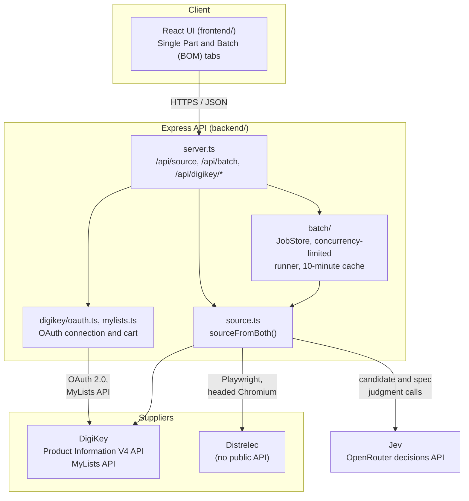

# Component Sourcing Platform

Automated Bill of Materials (BOM) sourcing across electronic component distributors. Given a part number — or a full BOM spreadsheet — the platform sources it from **DigiKey** and **Distrelec** at once, discovers every matching manufacturer without requiring one to be specified, scores each match by confidence, and can add confirmed matches directly to a DigiKey cart.

No manufacturer is taken as input. A part number can genuinely match more than one manufacturer's product, and every one of them is returned as its own result rather than the platform silently guessing.

## Documentation

- [Architecture](./docs/ARCHITECTURE.md) — the sourcing pipeline, design decisions, and known limitations
- [Jev API reference](./docs/jev-api-reference.md) — the decisions API used for Distrelec's judgment calls

## Current capabilities

**Sourcing**

- Dual-supplier lookup — DigiKey (public API) and Distrelec (browser automation, judged by Jev) queried in parallel for a single part number.
- Manufacturer discovery — a part number that matches several manufacturers returns every one of them, rather than one being silently chosen.
- Confidence scoring — DigiKey results are treated as authoritative (confidence 1.0); Distrelec results are scored by Jev on a 0–1 scale and labeled Confirmed match (≥ 0.85), Needs review (0.40–0.85), or Weak match (< 0.40).

**Batch (BOM) processing**

- CSV upload with flexible column matching (`MPN`, `Part Number`, and similar; `Package` and `Qty` are optional).
- Per-supplier concurrency limits (DigiKey up to 5 concurrent requests, Distrelec up to 2) and a 10-minute result cache, so duplicate part numbers in a BOM are not re-queried.
- Live progress, confidence-gated selection (Select all confirmed / Select all / Clear, with per-row control), and CSV export of the full report.

**DigiKey cart integration**

- OAuth 2.0 account connection — the user authenticates with their own DigiKey account.
- Selected items are added to a new list in the user's DigiKey account via the MyLists API.
- Checkout is never automated; the user completes the purchase on DigiKey's own site.

**Distrelec cart integration**

- No per-user OAuth — Distrelec's login page is bot-protected, so one shared account's session is captured once by a person (`npm run distrelec:login`) and reused for cart requests. See [Architecture](./docs/ARCHITECTURE.md) for why.
- Selected items are submitted to Distrelec's own "Bill of materials" tool (the same endpoints [distrelec.ch/en/bom-tool](https://www.distrelec.ch/en/bom-tool) uses), which matches each MPN and adds the matches to a cart.
- An MPN that matches more than one product is left for a person to resolve on Distrelec's own site rather than guessed at; these are reported back as skipped items.
- The captured session is short-lived (observed ~2 hours); once it expires, `npm run distrelec:login` needs to be run again.

## Architecture


```mermaid
flowchart TB
    subgraph Client
        UI["React UI (frontend/)\nSingle Part and Batch (BOM) tabs"]
    end

    subgraph API["Express API (backend/)"]
        ROUTES["server.ts\n/api/source, /api/batch, /api/digikey/*"]
        BATCH["batch/\nJobStore, concurrency-limited\nrunner, 10-minute cache"]
        PIPE["source.ts\nsourceFromBoth()"]
        OAUTH["digikey/oauth.ts, mylists.ts\nOAuth connection and cart"]
    end

    subgraph Suppliers
        DK["DigiKey\nProduct Information V4 API\nMyLists API"]
        DS["Distrelec\n(no public API)"]
    end

    JEV["Jev\nOpenRouter decisions API"]

    UI -- "HTTPS / JSON" --> ROUTES
    ROUTES --> BATCH --> PIPE
    ROUTES --> PIPE
    ROUTES --> OAUTH
    PIPE --> DK
    PIPE -- "Playwright,\nheaded Chromium" --> DS
    PIPE -- "candidate and spec\njudgment calls" --> JEV
    OAUTH -- "OAuth 2.0,\nMyLists API" --> DK
```

The frontend and backend communicate exclusively over the JSON API; there is no server-rendered page. In production, the Express server also serves the built frontend as static files, so the whole platform runs as a single deployable process. See [Architecture](./docs/ARCHITECTURE.md) for the detailed sourcing pipeline, the reasoning behind each supplier's approach, and known limitations.

## Tech stack

| Layer                | Technology                                                     |
| -------------------- | -------------------------------------------------------------- |
| Language and runtime | TypeScript, Node.js 24 (ESM)                                   |
| Backend              | Express 5, `tsx` in development, `tsc` for production builds   |
| Frontend             | React 19, Vite                                                 |
| Browser automation   | Playwright (Chromium)                                          |
| AI judgment          | Jev, via OpenRouter's decisions API                            |
| Supplier integration | DigiKey Product Information V4 API and MyLists API (OAuth 2.0) |
| Logging              | Pino                                                           |
| Testing              | Vitest, React Testing Library, Playwright (end-to-end)         |
| Code quality         | ESLint, Prettier, TypeScript strict mode, Knip (dead code)     |
| CI                   | GitHub Actions                                                 |
| Workspace management | npm workspaces                                                 |

## Project structure

A monorepo of three npm workspaces:

```
backend/    Express API and CLI
  src/
    digikey/     DigiKey API client, OAuth, MyLists (cart)
    distrelec/   Playwright navigation and data extraction
    jev/         Jev (decisions API) client and judgment calls
    batch/       BOM batch runner, job store, concurrency, cache
    bom/         CSV parsing and report export
    server.ts    HTTP API (also serves the built frontend in production)
    cli.ts       Command-line entry point
    config.ts    Environment variable validation
  .env          Local credentials (not committed)

frontend/   React UI
  src/
    features/single/   Single-part search
    features/batch/    BOM upload, results table, selection, cart
    hooks/             Batch polling, selection state, DigiKey connection
    lib/                Pure logic shared by the above (unit-tested independently)
    api.ts              Typed HTTP client for the backend API

shared/     Types shared between frontend and backend (API request and response shapes)

e2e/        Real-browser, real-supplier smoke test (run manually, not in CI)

docs/       Architecture, roadmap, and reference documentation
```

## Testing

```bash
npm test            # unit and component tests (backend and frontend) — no network access required
npm run typecheck    # shared, backend, and frontend
npm run lint
npm run knip         # unused files, exports, and dependencies across all three workspaces
npm run e2e          # real browser against the real suppliers, run manually
```

CI (`.github/workflows/ci.yml`) runs linting, a format check, typechecking, a dead-code check (knip, see `knip.json`), the full test suite, and a production build on every push. `npm run e2e` is intentionally excluded from CI: it drives real DigiKey and Distrelec sessions and consumes real API quota. Run it manually against a running instance of the application:

```bash
npm run build && npm start   # production mode, on http://localhost:3000
npm run e2e

# or against the development server:
E2E_BASE_URL=http://localhost:5173 npm run e2e
```

Set `E2E_CHECK_DIGIKEY_LOGIN=1` to also verify that "Connect DigiKey account" reaches DigiKey's real login page.

## Getting started

Requires **Node.js 24** — the repository's `.nvmrc` pins this version; with `nvm`, run `nvm use`.

```bash
git clone <this-repo-url>
cd JevBrowserAutomation-poc
nvm use
npm install                # installs all three workspaces
npm run install:browsers   # Playwright's Chromium (~350 MB)
cp backend/.env.example backend/.env
```

Populate `backend/.env` (see `backend/.env.example` for what each value is for):

```
OPENROUTER_JEV_API=...
DIGIKEY_CLIENT_ID=...
DIGIKEY_CLIENT_SECRET=...
DIGIKEY_USE_SANDBOX=false
DIGIKEY_OAUTH_REDIRECT_URI=...          # only required for DigiKey cart connection
APP_BASE_URL=http://localhost:5173      # development only; leave empty in production
DISTRELEC_TEST_EMAIL=...                # only required for Distrelec cart connection
DISTRELEC_TEST_PASSWORD=...             # only required for Distrelec cart connection
```

For Distrelec cart integration, also capture a session once — this opens a real, visible browser window for you to log in by hand (Distrelec's login page blocks automated sign-in):

```bash
npm run distrelec:login -w @jev/backend
```

| Command                                   | Description                                                                                                               |
| ----------------------------------------- | ------------------------------------------------------------------------------------------------------------------------- |
| `npm run dev`                             | Development: API on port 3000, React UI on `http://localhost:5173` with hot reload; `/api` is proxied to the backend.     |
| `npm run build && npm start`              | Production mode: builds both workspaces, then a single server on `http://localhost:3000` serves the API and the built UI. |
| `npm run source -- <MPN> [package] [qty]` | CLI: source a single part from both suppliers and print a results table and the full JSON response.                       |

A Distrelec lookup takes roughly 30–90 seconds — longer when a part resolves to several manufacturers, since each one requires its own product-page visit and verification pass. A real (but off-screen) Chromium window runs briefly during this — this is expected, not an error; see [Architecture](./docs/ARCHITECTURE.md#known-limitations) for why headed mode is required.

## License

Licensed under the [Apache License 2.0](./LICENSE).
