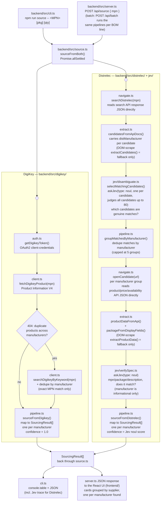

# Architecture

This document covers the sourcing pipeline in detail: the design decisions behind it, the reasoning that shaped them, and the engineering issues that were found and fixed during development. For a high-level overview of the system, see the [README](../README.md#architecture).

## Why two suppliers, two approaches

DigiKey exposes a public, documented REST API. Sourcing from it is a direct, deterministic API call with no judgment involved.

Distrelec exposes no public API. A search results page has to be read the way a human would — searched, scanned, and judged for whether a given result is actually the right part. Jev, an AI decision model accessed through OpenRouter, stands in for that human judgment: given a set of candidates, it decides which ones are genuinely plausible matches, and given a chosen product page, it decides whether the specification actually matches what was asked for.

The platform runs both paths side by side against the same request, so a client-facing report always shows a real comparison rather than results from only one source.

## Manufacturer discovery, not manufacturer input

No manufacturer is supplied as input — a component request is a bare part number, package, and quantity. This is deliberate: a part number can genuinely match more than one manufacturer's product (`ATMEGA328P-PU` is a common example), and there is no honest way to collapse that down to a single answer without being told which manufacturer is wanted.

Both supplier pipelines are built around this:

- **DigiKey.** An exact-MPN lookup (`ProductDetails`) can return a 404 with `"Duplicate Products found... provide manufacturerId"` when multiple manufacturers share an MPN. There is no direct MPN-to-manufacturer lookup endpoint (`/products/v4/manufacturers` also 404s), so this is resolved by calling DigiKey's `KeywordSearch` endpoint for a real candidate list, filtering to exact MPN matches, and deduplicating by manufacturer name. Every distinct manufacturer found becomes its own result.
- **Distrelec.** The Jev disambiguation step is framed as "which of these candidates are genuinely real matches" (one `noul` judgment per candidate), not "pick the single best one." Surviving matches are grouped by manufacturer (from the search API's own `distManufacturer` field), and each distinct manufacturer gets its own product-page open and verification pass.

As a result, `SourcingResult` (`shared/src/index.ts`) is one per `(supplier, manufacturer)` pair, not one per supplier — a single part number can legitimately produce several results from the same supplier.

## Judge every candidate, not a pre-filtered subset

An early version of the Distrelec disambiguation step capped the candidate list to the 15 entries whose text or URL most resembled the literal MPN, to bound the size of the judgment request. This broke real cases: Distrelec's product URLs are description slugs, not part numbers (for example `.../smd-resistor-125mw-1kohm-0805-yageo-rc0805fr-071kl/p/...`), so on a noisy DOM-scrape-fallback candidate list, no candidate matched the substring heuristic. The real product could land outside the top 15 and never get judged — confirmed on `RC0805FR-071KL`, which regressed to a false "not found."

The fix: judge every candidate up to the same cap `extractCandidates` already applies (80), and reference each candidate by index (`state.candidates[index]`) in the judgment request rather than repeating its text or link inline, so judging more candidates does not proportionally increase request size.

## Reading the backend APIs directly, not scraping the rendered page

Distrelec's storefront is an Angular single-page application. The rendered DOM lags behind the data that is actually available by an inconsistent amount — sometimes near-instant, sometimes over fifteen seconds — which made DOM-text scraping fundamentally unreliable regardless of how the wait was tuned (fixed delays, content-appearance waits, and retries were all tried and all still occasionally lost the race).

The fix was not a better wait; it was reading the same backend JSON APIs the page itself calls, directly, instead of waiting for Angular to paint them into the DOM:

| Purpose        | Endpoint                                                                                                                                                                   |
| -------------- | -------------------------------------------------------------------------------------------------------------------------------------------------------------------------- |
| Search results | `search.distrelec.com/api/apps/webshop/query/search?q=...` — a full structured document list (title, URL, manufacturer, price, stock status) in one deterministic response |
| Product detail | `api.distrelec.com/.../products/{id}` — manufacturer, description, and, via `displayFields`, labeled spec attributes such as package type                                  |
| Price          | `api.distrelec.com/.../products/{id}/prices`                                                                                                                               |
| Availability   | `api.distrelec.com/.../products/availability`                                                                                                                              |

DOM scraping (`extractCandidates`'s fallback path, `parseProductFields`'s regex parsing) is retained as a fallback in case Distrelec changes these endpoints, but it is not the primary path, and reliability differs sharply between the two — the API path is deterministic and fast, and the DOM path was the source of most flakiness during development.

## Sourcing pipeline

## Batch processing

A BOM upload (`POST /api/batch`) parses a CSV into a list of `ComponentRequirement`s (`backend/src/bom/parseCsv.ts`), creates a `BatchJob` (`backend/src/batch/jobStore.ts`), and runs `sourceFromBoth`-equivalent logic per row through a concurrency-limited runner (`backend/src/batch/runBatch.ts`):

- DigiKey requests run up to 5 at a time — a trusted API call, no meaningful rate-limit risk at that concurrency.
- Distrelec requests run up to 2 at a time, deliberately low, to avoid producing the kind of bursty automated traffic pattern that tends to trigger bot detection.
- Results are cached for 10 minutes (`backend/src/batch/cache.ts`), keyed by part number, so a BOM with duplicate lines does not needlessly repeat a lookup.

The frontend polls `GET /api/batch/:id` at a fixed interval until the job completes. All job and cache state is held in server memory — a restart clears it; there is no database yet.

## DigiKey account connection and cart

Adding sourced parts to a cart uses DigiKey's MyLists API, which requires the three-legged OAuth Authorization Code flow (a per-user token), not the client-credentials flow used for product search. The flow (`backend/src/digikey/oauth.ts`):

1. The user clicks "Connect DigiKey account," which redirects their browser to DigiKey's real login and consent page.
2. DigiKey redirects back to `GET /api/digikey/oauth/callback` with an authorization code and a state value, which is checked against the one this server issued before the redirect (CSRF protection).
3. The code is exchanged for an access token and a refresh token. DigiKey issues a new refresh token on every refresh, so the stored value is replaced each time, not reused.
4. `POST /api/digikey/cart/add` creates a new DigiKey list and adds the selected items to it (`backend/src/digikey/mylists.ts`).

Checkout is never automated — the user completes the purchase on DigiKey's own site, under their own account. This is deliberate: automating a wrong search result is a minor inconvenience, automating a wrong purchase is not.

The connection is currently a single slot for the whole running server process, not tied to an individual user — there is no per-user account system yet.

Selecting items across DigiKey's OAuth redirect would normally lose the in-progress batch: the redirect is a full-page navigation, which wipes all in-memory React state. `frontend/src/lib/digikeyReturn.ts` saves the batch's job ID and per-row selection choices to `sessionStorage` right before the redirect (`BatchPanel.handleConnectDigikey`), and `BatchPanel` reads and clears that state once on mount, re-fetching the job from `GET /api/batch/:id` and restoring the selections. `sessionStorage` survives the round trip because it's scoped to `(origin, tab)`, not to whatever page loaded in between. If the job can no longer be found (e.g. the server restarted and lost its in-memory job store), the restore fails gracefully and tells the user to re-run the batch instead of silently discarding their DigiKey connection.

## Distrelec account connection and cart

Distrelec's cart uses a different approach from DigiKey's, because Distrelec's login page itself is bot-protected — a per-user OAuth-style flow isn't viable when the automated part of that flow (signing in) is exactly what gets blocked (see "Known limitations" below). Instead, one shared account's session is captured by a real person, once, and reused server-side:

1. A person runs `npm run distrelec:login -w @jev/backend`, which opens a real, visible Chromium window (`backend/src/distrelec/captureSession.ts`) and waits for them to log in and clear any bot check by hand.
2. Playwright's storage state (cookies + `localStorage`) is saved to `backend/.distrelec-session.json` (gitignored — this is a live credential, not committed).
3. `backend/src/distrelec/session.ts` reads the bearer token out of that file's `spartacus⚿⚿auth` `localStorage` entry on each request. The token is short-lived (observed ~2 hours) with no client-accessible refresh token, so once it expires, the only fix is repeating step 1 — there is no silent refresh.
4. `POST /api/distrelec/cart/add` (`backend/src/distrelec/cart.ts`) submits selected items to Distrelec's own "Bill of materials" tool API — the same endpoints [distrelec.ch/en/bom-tool](https://www.distrelec.ch/en/bom-tool) calls from the browser — rather than driving that page with Playwright: review the BOM (matches, duplicates, unavailable, not-found), get-or-create a cart, then bulk-add the matched products.

As with DigiKey, an MPN matching more than one product is never guessed at — it's reported back as a skipped item (`reason: "ambiguous"`) for a person to resolve on Distrelec's own site. Checkout is likewise never automated.

The connection is a single shared-account slot for the whole server process, same as DigiKey's current state — there is no per-user Distrelec account system.

## Known limitations

- **Distrelec runs in headed (visible) browser mode, not headless.** Distrelec runs Radware Bot Manager. A default headless launch is challenged or blocked immediately, keyed off the `HeadlessChrome` user-agent string; a spoofed-user-agent headless attempt worked once but was inconsistently blocked on repeat requests. Headed mode is the only approach that has been reliable in testing. This is not viable as-is on a typical server, which has no display — the planned fix is running headed Chromium under a virtual display (Xvfb).
- **Distrelec's login page specifically adds an invisible reCAPTCHA gate on top of Radware** — a real click on the sign-in submit button registers, but no login network call ever fires when done via Playwright's automated click. This is why cart integration captures a real person's session (see "Distrelec account connection and cart" above) instead of automating the login itself.
- **Distrelec cart hasn't been verified against a real add-to-cart call yet.** The BOM-review, cart-lookup, and bulk-add endpoints were confirmed against real, live calls while building the feature, but `unavailableProducts` in the BOM-review response (one of the "why was this item skipped" buckets) was never reproduced live and is extracted defensively rather than assumed. A full run through the UI against a live cart hasn't happened yet.
- **Distrelec's catalog genuinely differs from DigiKey's.** Several real, common parts (`LM358P`, `NE555P`, a specific TE Connectivity connector) return zero results directly from Distrelec's own search backend — confirmed by testing broader search terms (for example, `LM358` without the exact suffix returns real results under different package variants). This reflects real inventory differences between distributors, not a defect in the pipeline.
- **The DOM-scraping fallback paths are lightly tested.** Since the API-first approach became the primary path, the DOM-scrape fallback (`extractCandidates`, `parseProductFields`) rarely executes and has not been exercised as thoroughly as the primary path.
- **The DigiKey MyLists "create list" response field for the new list's ID has not been confirmed against a live call.** The code checks several plausible field-name casings and fails with a clear error if none match, rather than silently proceeding with an incorrect value.

## Engineering notes

Issues found and fixed during development, worth knowing about before touching this code:

- `choice`-type Jev questions require `criteria` as a record (`{ key: description }`), not an array, despite the original example in `docs/jev-api-reference.md` — the live API rejects an array with a 400.
- `parseInt(x) || null` silently turns a genuine `0` result into `null`, since `0` is falsy in JavaScript. This hid a real "0 in stock" result as an apparent capture failure; check for `NaN` explicitly instead.
- Named local functions inside `page.evaluate()` throw `ReferenceError: __name is not defined` under `tsx`/esbuild — inline the logic rather than assigning it to a named function.
- Do not cap a Jev candidate-judging batch by a substring-match heuristic when a candidate's text or URL may not contain the literal search term at all — see "Judge every candidate" above. `RC0805FR-071KL` regressed to a false Distrelec "not found" this way.
